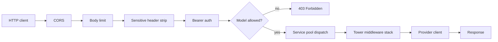

# Proxy Server

The `liter-llm` binary ships with a production proxy that speaks the OpenAI REST API on top of any of the 143 supported providers. It terminates Bearer auth, routes by model name, applies the full Tower middleware stack (cache, budget, rate limit, cooldown, health, fallback), and exposes OpenTelemetry spans.

Point any OpenAI SDK at the proxy URL and it works unchanged.

## Quick start

Start the server against an auto-discovered `liter-llm-proxy.toml`:

```bash
liter-llm api
```

Start with an explicit config and a master key from the environment:

```bash
export LITER_LLM_MASTER_KEY="sk-proxy-master-$(openssl rand -hex 16)"
liter-llm api --config ./liter-llm-proxy.toml
```

The default bind address is `0.0.0.0:4000`. Override with `--host` and `--port`.

A minimal config that exposes one OpenAI model:

```toml
[general]
master_key = "${LITER_LLM_MASTER_KEY}"

[[models]]
name = "gpt-4o"
provider_model = "openai/gpt-4o"
api_key = "${OPENAI_API_KEY}"
```

Send a request:

--8<-- "snippets/curl/server/chat.md"

See [Proxy Configuration](proxy-configuration.md) for every config field.

## Command-line flags

| Flag | Default | Purpose |
|------|---------|---------|
| `--config`, `-c` | auto-discover | Path to `liter-llm-proxy.toml`. Walks from the current directory up to the filesystem root when omitted. |
| `--host` | `0.0.0.0` | Bind address. Overrides `[server].host`. |
| `--port`, `-p` | `4000` | Bind port. Overrides `[server].port`. |
| `--master-key` | `$LITER_LLM_MASTER_KEY` | Master API key. Overrides `[general].master_key`. |
| `--debug` | off | Enable debug-level tracing. Equivalent to `RUST_LOG=debug`. |

CLI flags take precedence over config file values, which take precedence over defaults.

## Endpoints

The proxy exposes 26 HTTP method registrations across 23 unique routes. All `/v1/*` routes require a Bearer token. Health and OpenAPI endpoints are public.

### LLM operations

| Method | Path | Request body | Notes |
|--------|------|--------------|-------|
| POST | `/v1/chat/completions` | `ChatCompletionRequest` | Supports SSE streaming when `stream: true`. |
| POST | `/v1/embeddings` | `EmbeddingRequest` | |
| GET | `/v1/models` | n/a | Lists configured `[[models]]` and aliases. |
| POST | `/v1/images/generations` | `CreateImageRequest` | |
| POST | `/v1/audio/speech` | `CreateSpeechRequest` | Returns audio bytes. |
| POST | `/v1/audio/transcriptions` | multipart | Speech to text. |
| POST | `/v1/moderations` | `ModerationRequest` | |
| POST | `/v1/rerank` | `RerankRequest` | Extended endpoint, not in OpenAI API. |
| POST | `/v1/search` | `SearchRequest` | Extended endpoint. |
| POST | `/v1/ocr` | `OcrRequest` | Extended endpoint. |

### Files

| Method | Path | Purpose |
|--------|------|---------|
| POST | `/v1/files` | Upload a file (multipart). |
| GET | `/v1/files` | List files. |
| GET | `/v1/files/{file_id}` | Retrieve file metadata. |
| DELETE | `/v1/files/{file_id}` | Delete a file. |
| GET | `/v1/files/{file_id}/content` | Retrieve raw file bytes. |

### Batches

| Method | Path | Purpose |
|--------|------|---------|
| POST | `/v1/batches` | Create a batch job. |
| GET | `/v1/batches` | List batch jobs. |
| GET | `/v1/batches/{batch_id}` | Retrieve a batch job. |
| POST | `/v1/batches/{batch_id}/cancel` | Cancel an in-progress batch. |

### Responses

| Method | Path | Purpose |
|--------|------|---------|
| POST | `/v1/responses` | Create a response (Responses API). |
| GET | `/v1/responses/{response_id}` | Retrieve a response. |
| POST | `/v1/responses/{response_id}/cancel` | Cancel a response. |

### Health and discovery

| Method | Path | Auth | Purpose |
|--------|------|------|---------|
| GET | `/health` | public | Full status including configured model list. |
| GET | `/health/liveness` | public | Always returns 200 while the process is alive. Use as a Kubernetes liveness probe. |
| GET | `/health/readiness` | public | Returns 200 once the service pool is initialised. Use as a readiness probe. |
| GET | `/openapi.json` | public | Machine-readable OpenAPI 3.1 schema for every `/v1/*` route. |

## Request lifecycle

Every authenticated request passes through this pipeline:



The Tower stack composes: tracing, cost tracking, cache, budget, rate limit, cooldown, health check, fallback. Layer order is set in `service_pool.rs` when the pool is built.

## Deployment

### Docker

A 35 MB statically-linked image is published on every release:

```bash
docker run --rm -it \
  -p 4000:4000 \
  -v "$PWD/liter-llm-proxy.toml:/etc/liter-llm-proxy.toml:ro" \
  -e LITER_LLM_MASTER_KEY \
  -e OPENAI_API_KEY \
  ghcr.io/kreuzberg-dev/liter-llm:latest \
  api --config /etc/liter-llm-proxy.toml
```

### Docker Compose

```yaml
services:
  liter-llm:
    image: ghcr.io/kreuzberg-dev/liter-llm:latest
    command: api --config /etc/liter-llm-proxy.toml
    ports:
      - "4000:4000"
    volumes:
      - ./liter-llm-proxy.toml:/etc/liter-llm-proxy.toml:ro
    environment:
      LITER_LLM_MASTER_KEY: ${LITER_LLM_MASTER_KEY}
      OPENAI_API_KEY: ${OPENAI_API_KEY}
      ANTHROPIC_API_KEY: ${ANTHROPIC_API_KEY}
    healthcheck:
      test: ["CMD", "curl", "-fsS", "http://localhost:4000/health/readiness"]
      interval: 10s
      timeout: 3s
      retries: 3
```

### Kubernetes

Point the liveness and readiness probes at the dedicated health endpoints:

```yaml
livenessProbe:
  httpGet:
    path: /health/liveness
    port: 4000
  initialDelaySeconds: 5
  periodSeconds: 10

readinessProbe:
  httpGet:
    path: /health/readiness
    port: 4000
  initialDelaySeconds: 2
  periodSeconds: 5
```

## HTTP behaviour

| Concern | Default | Controlled by |
|---------|---------|---------------|
| Request timeout | 600 s | `[server].request_timeout_secs` |
| Body size limit | 10 MiB | `[server].body_limit_bytes` |
| CORS origins | `*` | `[server].cors_origins` |
| Response compression | always on | built in (`tower_http::CompressionLayer`) |
| Panic handling | caught and returned as 500 | built in (`tower_http::CatchPanicLayer`) |
| `Authorization` redaction in logs | always on | built in (`SetSensitiveHeadersLayer`) |

CORS is wide open by default so the proxy works from any browser app during development. Restrict it to a known origin list before shipping to production.

## Verify a running instance

```bash
curl -fsS http://localhost:4000/health/readiness && echo "ready"
curl -fsS http://localhost:4000/v1/models \
  -H "Authorization: Bearer $LITER_LLM_MASTER_KEY"
```

If the readiness probe returns 200 and `/v1/models` lists the expected models, the proxy is serving traffic.
